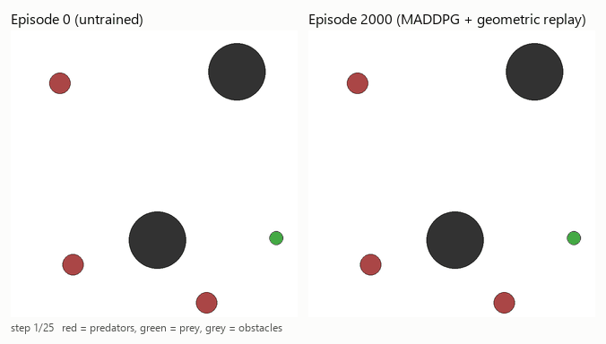
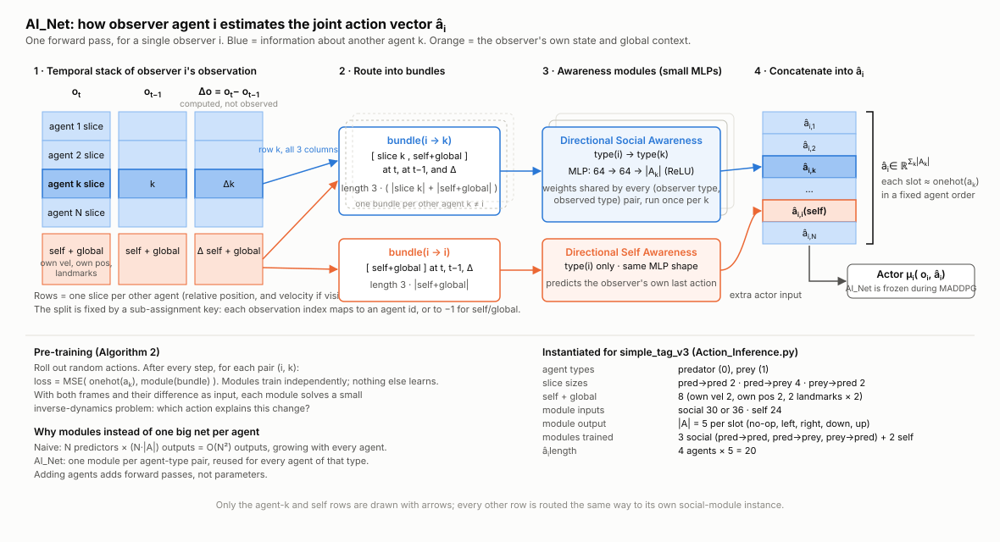
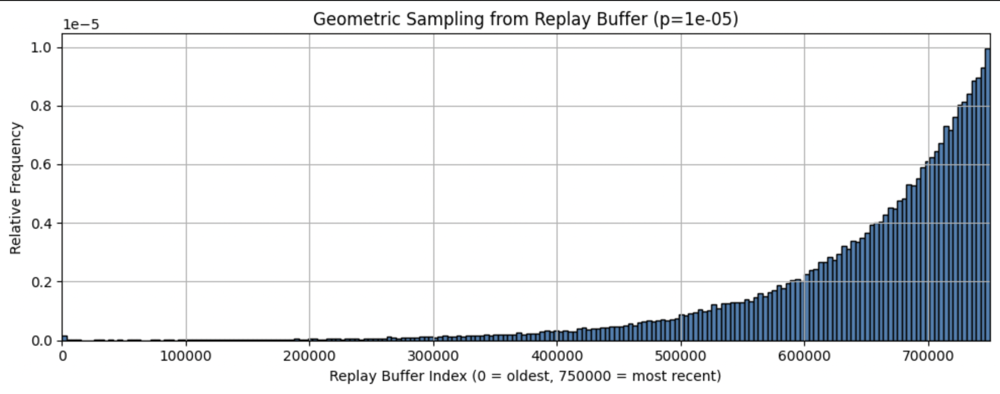
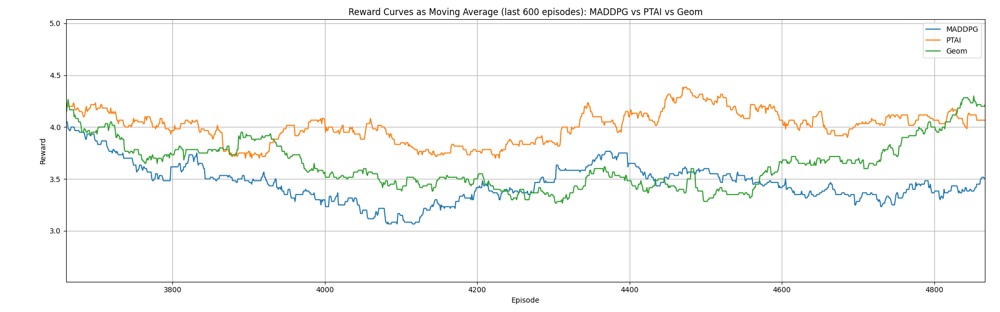
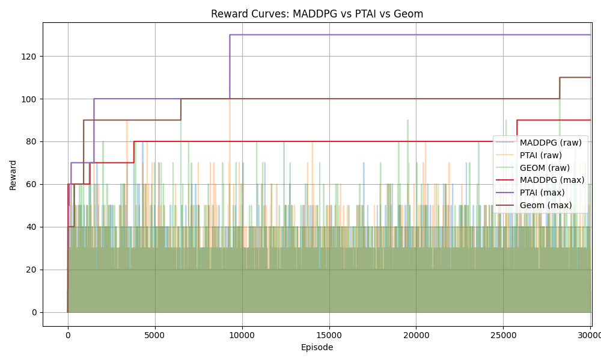

<div align="center">

# Enhancing MADDPG with Action Inference and Geometric Replay Sampling

**Multi-agent reinforcement learning on the PettingZoo Predator–Prey task, with two modifications that target the non-stationarity problem.**

[](https://arxiv.org/abs/2606.05021)
[](Enhancing_MADDPG_Paper.pdf)
[](https://www.python.org/)
[](https://pytorch.org/)
[](https://pettingzoo.farama.org/environments/mpe/simple_tag/)



*Same seed, same prey start. Left: untrained predators drift while the prey wanders off. Right: after 2,000 episodes of MADDPG with geometric replay (`visualize_training.py`), two predators sandwich the prey against an obstacle and tag it four times in 25 steps. Both sides learn: the prey is also trained, so it now hugs obstacles instead of leaving the arena.*

</div>

---

## Paper

> **Enhancing the MADDPG Algorithm for Multi-Agent Learning via Action Inference and Importance Sampling**
> arXiv:2606.05021 (cs.LG), June 2026 · [arXiv page](https://arxiv.org/abs/2606.05021) · [PDF](https://arxiv.org/pdf/2606.05021) · [local copy](Enhancing_MADDPG_Paper.pdf)

**Abstract.** We investigate multi-agent deep reinforcement learning and propose two enhancements to the Multi-Agent Deep Deterministic Policy Gradient (MADDPG) algorithm. First, we introduce an Action Inference mechanism that enables each agent to predict other agents' actions, improving the accuracy and stability of its own policy. Second, we apply a recency-biased sampling strategy, using a geometric distribution over the replay buffer, to prioritise more recent and informative experiences, which helps mitigate the non-stationarity inherent in multi-agent environments. We evaluate both modifications on the discrete-action Predator–Prey task from PettingZoo. Action Inference improves learning stability and inter-agent cooperation, and geometric sampling improves exploration efficiency over standard MADDPG.

---

## The problem in one paragraph

In a multi-agent environment every agent is learning at once, so from any single agent's point of view the environment keeps changing: the same observation and action lead to different outcomes depending on what the *other* agents have learned to do this week. This **non-stationarity** breaks the Markov assumption that standard Q-learning and experience replay rely on. MADDPG ([Lowe et al., 2017](https://arxiv.org/abs/1706.02275)) softens the problem with **centralised training, decentralised execution** (CTDE): each agent's critic sees the joint state and all agents' actions during training, while each actor only sees its own local observation at run time. This repo starts from that baseline and adds two targeted fixes, one on the actor's input side and one on the replay buffer.

## Environment: Predator–Prey (`simple_tag_v3`)

| | |
|---|---|
| **Agents** | 3 predators (`adversary_0..2`, slower) and 1 prey (`agent_0`, faster) |
| **Obstacles** | 2 fixed landmarks |
| **Actions** | Discrete(5): no-op, left, right, down, up |
| **Observation** | 16-dim for predators, 14-dim for prey: own velocity + position, relative positions of landmarks and other agents, and velocity of the prey |
| **Reward** | Predators: +10 for each collision with the prey (shared). Prey: −10 per collision, plus a penalty for leaving the arena |
| **Dynamics** | Mixed cooperative–competitive: predators must cooperate to corner a faster target |

## The training cycle, with both enhancements

<p align="center">
  
</p>

The loop is the standard MADDPG cycle, **act → store → sample → update critics → push gradients into actors**, with two blue additions:

1. **Action Inference (①)** gives each actor an estimate `â_i` of what every other agent just did, computed from two consecutive observations by a small pre-trained network. The actor becomes `μ_i(o_i, â_i)` instead of `μ_i(o_i)`.
2. **Geometric replay sampling (②)** replaces uniform minibatch sampling with indices drawn from a geometric distribution measured from the newest transition, so training data reflects the *current* behaviour of the other agents rather than stale policies from thousands of episodes ago.

### ① Action Inference (`AI_Net`)

<p align="center">
  
</p>

*Read left to right: (1) stack the observation at `t` and `t−1` and compute their difference; (2) for each other agent `k`, bundle its slice with the observer's own block; (3) run each bundle through a small MLP that is shared by every (observer type, observed type) pair; (4) concatenate the per-agent predictions into `â_i` and hand it to the actor. The original hand-drawn version is Figure 2 of the [paper](Enhancing_MADDPG_Paper.pdf).*

**Goal.** Give agent *i* an estimate of the joint action vector `â_i ≈ concat(onehot(a_1), …, onehot(a_N))` from its own observations only, so that the other agents stop looking like unexplained noise.

**Why not one big network per agent?** A naive predictor outputs `N × |A|` values for each of `N` agents, i.e. `O(N²)` outputs, and would need to grow with every new agent.

**Our design: separable modules.** When the observation can be partitioned into per-agent slices (as in MPE, where each agent's slot is a known index range), we train only one small module per *(observer type, observed type)* pair and reuse it for every agent of that type:

- **Directional Social Awareness Module.** Input: the observer's slice for agent *k* at `t` and `t−1`, their difference `Δo`, plus the observer's own "self/global" slice. Output: `â_{i,k}`, a prediction of `onehot(a_k)`.
- **Directional Self Awareness Module.** Same idea applied to the agent's own slice, predicting its own last action (proprioception).
- The temporal difference `Δo = o_t − o_{t−1}` is computed explicitly and fed in alongside the raw frames, which lets a 64-64 MLP solve what is essentially an inverse-dynamics problem.

**Training.** `AI_Net` is pre-trained on random-policy rollouts with an MSE loss against the true one-hot actions, then **frozen**. Because it is stationary, it adds no extra non-stationarity to the MADDPG optimisation and almost no compute at run time. During MADDPG training the actor consumes `[o_i, â_i]` (paper, Algorithm 3).

### ② Geometric (recency-biased) replay sampling

<p align="center">
  
</p>

Standard MADDPG samples the replay buffer uniformly, so a transition generated 20,000 episodes ago, when the other agents behaved completely differently, is as likely to be used as one from the last episode. We instead draw a reverse index `k` from a geometric distribution and read the `k`-th newest transition:

```text
P(X = k) = (1 − p)^(k−1) · p,   k = 1, 2, 3, …        index = N − k
```

Larger `p` means a thinner tail and a stronger recency bias; `p → 0` recovers uniform sampling. The paper uses `p = 1e-5` with a 750k-transition buffer.

## Results (from the paper)

**Setup.** Both predators and prey are first trained with vanilla MADDPG. The resulting prey actor is then **frozen** and treated as part of the environment, so the remaining task is purely cooperative: three predators must learn to catch a competent, faster evader. Three predator training runs are then compared: standard **MADDPG**, MADDPG with **pre-trained Action Inference (PTAI)**, and MADDPG with **geometric sampling (Geom)**.

| Hyper-parameter | Value |
|---|---|
| Episodes × steps | 30,000 × 25 |
| Random-action warm-up | first 2,000 episodes |
| Optimiser / learning rate | Adam, 0.01 |
| Batch size | 1,024 |
| Soft-update rate τ | 0.02 |
| Actor / critic | 64-unit ReLU MLPs (3 / 2 hidden layers), Xavier init |
| Geometric `p` | 1e-5 |

<p align="center">
  
</p>

<p align="center">
  
</p>

| Method | What we observed |
|---|---|
| **MADDPG** (baseline) | Slowest to discover high-reward behaviour; oscillating moving average; lowest cumulative max throughout. |
| **PTAI** (Action Inference) | Sets itself apart early and holds the highest moving average for most of training; smoother updates, highest cumulative max. The extra input disambiguates observations that would otherwise look identical. |
| **Geom** (geometric sampling) | Matches the baseline early, then as the buffer fills it "lifts off" on good runs and overtakes the baseline; late in training it reaches or exceeds PTAI. |

The persistent ordering of the cumulative-max curves (PTAI > Geom > MADDPG) is the key evidence: if all three methods explored equally well, the leader would change at random.

## Repository layout

| File | What it does |
|---|---|
| [`MADDPG.py`](MADDPG.py) | Actor / Critic networks, `MADDPGAgent` (soft target updates, gradient clipping), `ReplayBuffer`, and the baseline training loop on `simple_tag_v3`. |
| [`Action_Inference.py`](Action_Inference.py) | `AI_Net` manager plus the `Awareness` modules, and `pre_train_ai_net()` which trains them on random rollouts (paper, Algorithm 2). |
| [`visualize_training.py`](visualize_training.py) | Training driver built on the same classes with a `GeometricReplayBuffer`, reward logging, and rollout GIF snapshots at chosen episodes. Produces the animation at the top of this page. |
| [`test.py`](test.py) | Evaluation script: loads actors, runs deterministic episodes, saves GIFs and a reward plot. |
| [`assets/`](assets/) | Figures: training-cycle diagram, rollout GIF, and the paper's figures. |
| [`Enhancing_MADDPG_Paper.pdf`](Enhancing_MADDPG_Paper.pdf) | The paper. |

## Quick start

```bash
git clone https://github.com/H-Khan26/MADDPG.git && cd MADDPG
python -m venv .venv && source .venv/bin/activate     # Windows: .venv\Scripts\activate
pip install -r requirements.txt
```

> PettingZoo moved the MPE environments into a separate `mpe2` package from version 1.25 onward. This code targets `pettingzoo==1.24.3`, where `from pettingzoo.mpe import simple_tag_v3` still works. On newer PettingZoo, `pip install mpe2` and change the import to `from mpe2 import simple_tag_v3`.

```bash
# Baseline MADDPG on simple_tag_v3 (saves a reward plot under results/)
python MADDPG.py

# Pre-train the Action Inference network on random rollouts (saves AI_Net.pkl)
python Action_Inference.py

# Train with geometric sampling and record rollout GIFs every 500 episodes
python visualize_training.py --out results/geom --episodes 4000 --sampler geometric --geom-p 1e-4
```

## Roadmap

Planned extensions, roughly in order of effort:

- [ ] Seeded, config-driven runs (≥5 seeds) with interquartile-mean learning curves and bootstrap confidence intervals, following the [MARL evaluation protocol](https://arxiv.org/abs/2209.10485).
- [ ] A 2×2 ablation {± Action Inference} × {uniform vs geometric replay}, plus a sweep over `p`.
- [ ] Report task metrics (capture rate, time-to-capture) alongside reward.
- [ ] Baselines through [BenchMARL](https://github.com/facebookresearch/BenchMARL): MAPPO, IPPO, QMIX, and MADDPG with the original "inferred policies" variant.
- [ ] Competing fixes for non-stationarity: FIFO buffer size sweep, prioritised replay, [ERE](https://arxiv.org/abs/1906.04009), and [fingerprints](https://arxiv.org/abs/1702.08887).
- [ ] Partial observability (limited sensing radius) and 5–8 predators, which stress the fixed-size critic.
- [ ] A bridge to a real domain: multi-vehicle intersection negotiation in [highway-env](https://highway-env.farama.org/multi_agent/), where action inference becomes "will the other car yield?".

## Related work

- **MADDPG** — Lowe et al., *Multi-Agent Actor-Critic for Mixed Cooperative-Competitive Environments*, NeurIPS 2017. [arXiv](https://arxiv.org/abs/1706.02275). Section 4.2 also fits approximate models of other agents' policies; our contribution is the separable, pre-trained, type-shared module design with explicit temporal differences.
- **Agent modelling** — LIAM (Papoudakis et al., NeurIPS 2021, [arXiv](https://arxiv.org/abs/2006.09447)); ToMnet (Rabinowitz et al., ICML 2018, [arXiv](https://arxiv.org/abs/1802.07740)).
- **Replay and non-stationarity** — Foerster et al., *Stabilising Experience Replay for Deep Multi-Agent RL*, ICML 2017 ([arXiv](https://arxiv.org/abs/1702.08887)); Wang & Ross, *Emphasizing Recent Experience*, 2019 ([arXiv](https://arxiv.org/abs/1906.04009)); Schaul et al., *Prioritized Experience Replay*, ICLR 2016 ([arXiv](https://arxiv.org/abs/1511.05952)).
- **Environment** — PettingZoo (Terry et al., NeurIPS 2021, [site](https://pettingzoo.farama.org/)); original MPE from OpenAI ([repo](https://github.com/openai/multiagent-particle-envs)).
- **Starting point** — the baseline loop was adapted from [Git-123-Hub/maddpg-pettingzoo-pytorch](https://github.com/Git-123-Hub/maddpg-pettingzoo-pytorch).

